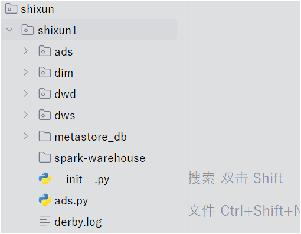
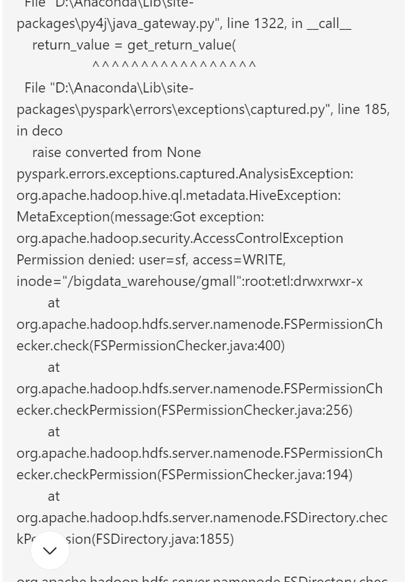
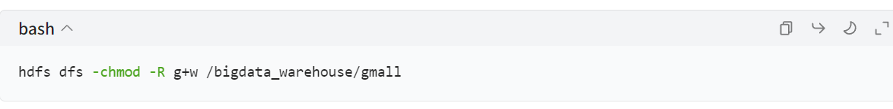
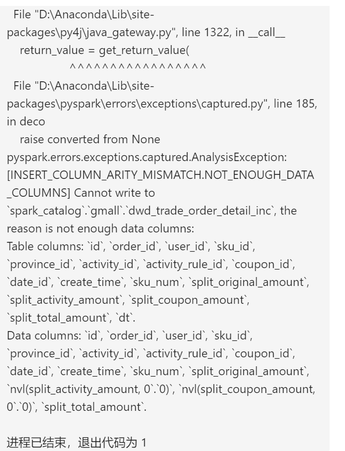
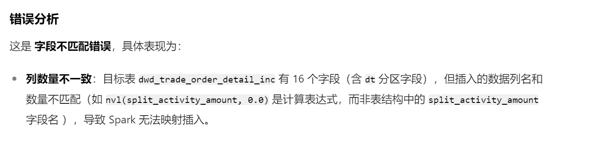

#2025.7.18 日报
1 今天内容是将昨天没有整完的物流数仓项目剩余的几个层去解决完毕
2 在做的时候出现的问题：
出现最多的问题是出现hive权限不够的情况，比如
出现这种问题我都一般是上豆包截屏然后让他给我发个命令去解决 如：
然后就是字段不匹配的情况，出现这个错误就需要我去改字段
然后许多代码都是复制的，需要把他那个数据库的名字改成自己的名字，然后还是dt 时间改成数据库的自己的时间
3然后就是数据大部分都出来，除了一些个别的数据没有搞出来，争取在这个星期六日，加班加点去把他给搞明白，不争取能够学的
多会只希望在答辩的时候能够把代码逻辑搞清楚，知道哪个地方做什么。