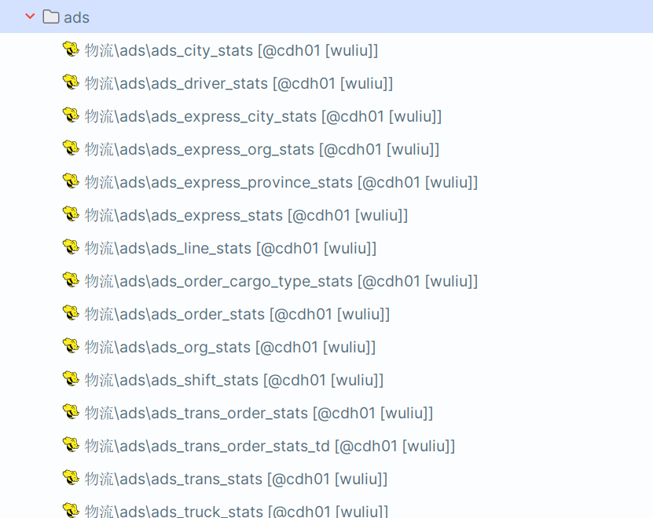
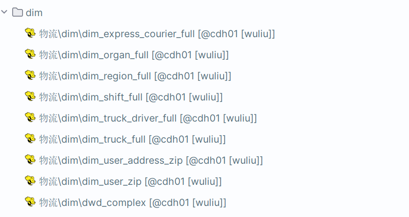
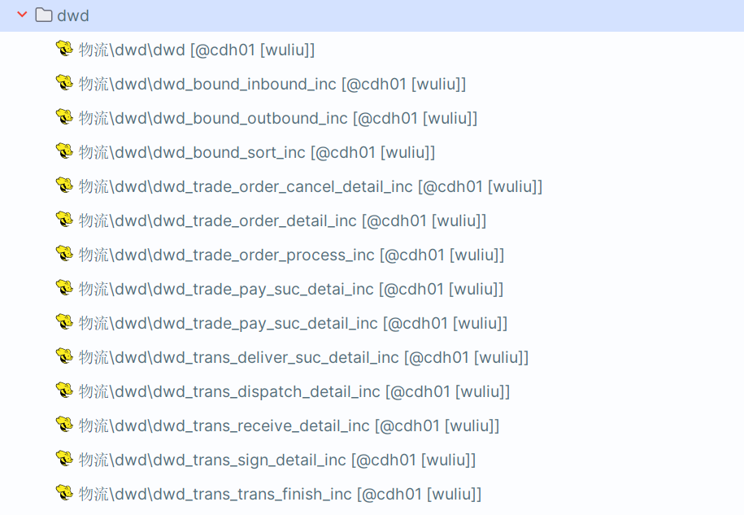
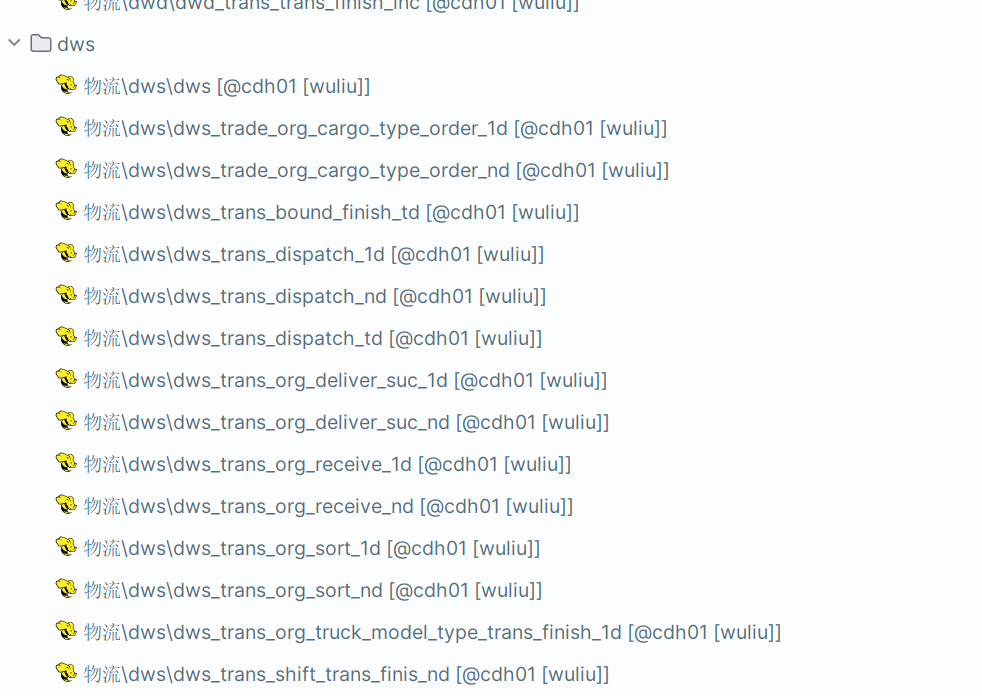
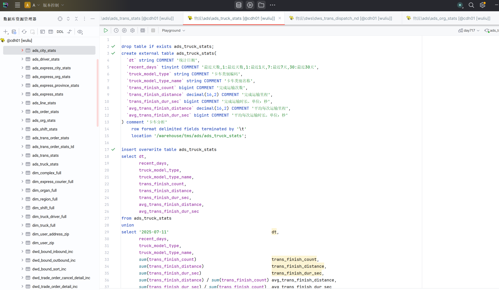
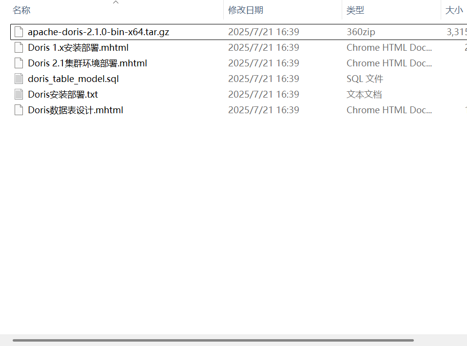

#         7.21日报
1.今天上午主要做的内容是物流表的数据导入，昨天晚上就已经吧dim层
里面的数据给整完了，就剩下三个层，ads,dws,dwd,由于已经做过很多遍了，基本上不会不会出现一些
难以解决的问题，也是很快整完了

2.然后下午的话去整小组安排的任务，我的任务里面出现了doris，然后去上官网，
去找下载需要下载的包
就是看着他那个操作就行，感觉不是太难，但是最后启动服务的时候一直报错

[comment]: <> (--The JAVA_HOME environment variable is not defined correctly)

[comment]: <> (This environment variable is needed to run this program)

[comment]: <> (NB: JAVA_HOME should point to a JDK not a JRE)

[comment]: <> (You can set it in be.conf--)
以上是我的报错内容，虽然也去豆包上面搜了，但是也没有解决，往往把这个启动命令整好之后，但是另一个就又会报错
晚自习也是去找了隔壁班的人帮我，连接我的电脑去帮我整，明明操作什么的也没有什么问题，但是就是出不来，
一直报错，预计明天整完